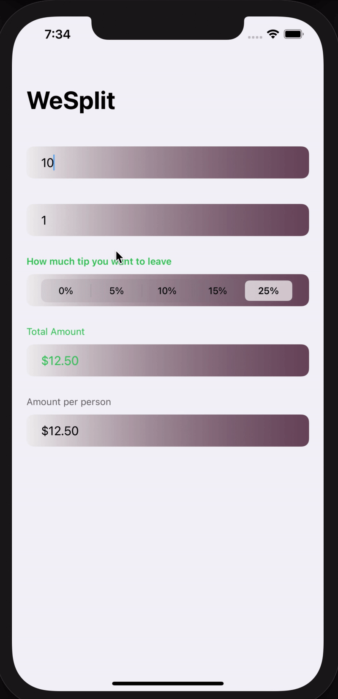
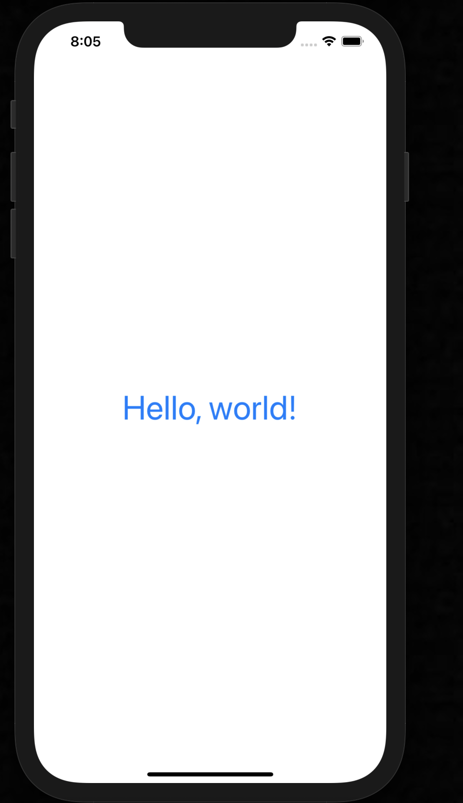

# What is 100 Days Of SwiftUI?
It's free course which has been created by Paul Hadson. It's a new version (SwiftUI) of 100 Days Of Swift (which uses UIKit)

Footnote:  The all "100 Days" series serve one purpose: "Making a habit". So, this course gives you a habit at Swift and that's also why I used Paul's course to learn. 

for more information (also for getting started)
https://www.hackingwithswift.com/100/swiftui

# Projects
- [Project 1: WeSplit](./Project-1-WeSplit)
- [Day 16](https://www.hackingwithswift.com/100/swiftui/16)

  

- [Challange 1](https://github.com/GrandSir/100DaysOfSwiftUI/tree/main/Challange-1-Day19)
- [Day 19](https://www.hackingwithswift.com/100/swiftui/19)

  

- [Project 2: Guess The Flag](https://github.com/GrandSir/100DaysOfSwiftUI/tree/main/Project-2-Guess%20The%20Flag)
- [Day 21](https://www.hackingwithswift.com/100/swiftui/21)

  

- [Challange 2](https://github.com/GrandSir/100DaysOfSwiftUI/tree/main/Challange-2-Day24)
- [Day 24](https://www.hackingwithswift.com/100/swiftui/24)

  

- [Challange 2](https://github.com/GrandSir/100DaysOfSwiftUI/tree/main/Milestone-Project-1)
- [Day 25](https://www.hackingwithswift.com/100/swiftui/25)

  

- [Project 6: iExpense](https://github.com/GrandSir/100DaysOfSwiftUI/tree/main/Project-6-iExpense)
- [Day 37](https://www.hackingwithswift.com/100/swiftui/37)

  <video width="300px" controls>
    <source src="./Assets/iExpense.mov" type="video/mov">
  </video>

